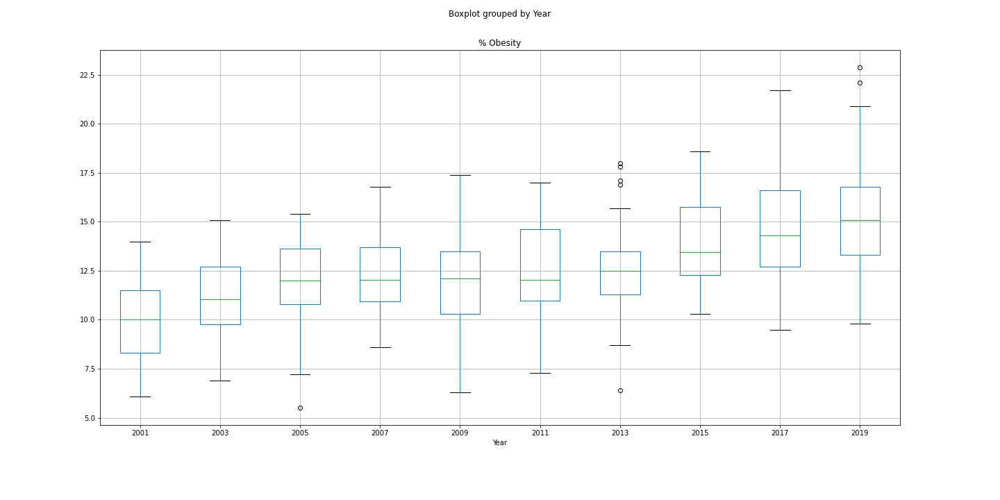
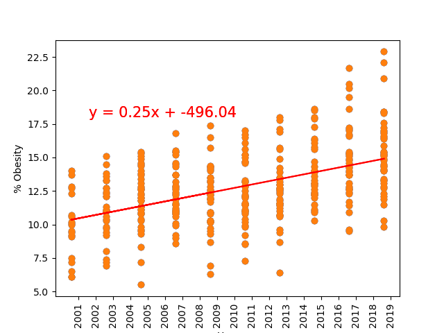
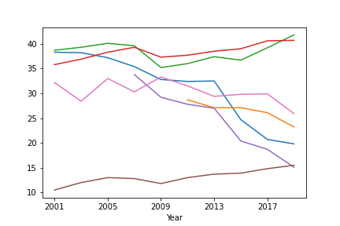
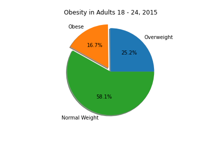
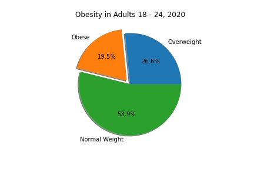
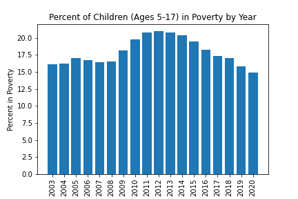

# Healthy Hunger Free Kids Act and its Effects on Obesity in the United States 

## Overview
In this collaborative repository, the relationship between the initiation of the Healthy Hunger Free Kids Act (HHFKA) and obesity rates betweeen children of school age was analyzed. HHFKA was put into effect 2010 and was designed to provide more nutritious food for school age children as well as free lunch programs. Users utilized jupyter notebook to analyze the data and matplotlib to visualize the results. 

## Analysis

The data analyzed was used to answer the following questions:

    1. Was the Healthy Hunger-Free Kids Act successful in decreasing the rate of childhood obesity?

    2. Was there a long-term effect on obesity related to this program?

    3. Is there a relationship between children in poverty and prevalence of obesity?

Matplotlib was used to visualize the results of the relationship between the data and different variables. These variables inlcude poverty and gender, as well as obesity rates prior to the implementation of HHFKA and after its implementation. 

## Hypothesis and Null Hypothesis

    Null Hypothesis
        There was no difference in childhood obesity after the implementation of HHFKA
    Hypothesis
        There was a statistically significant difference in the percentage of children with childhood obesity after the implementation of HHFKA in 2010.

## Initial Review of Data

Anova equations and linear regression were used to determine if there had been a statistically significant change in childhood obesity from the years 2001 - 2019.  

Anova and boxplot analysis revealed statistical changes of obesity from 2001 - 2019.  The scatterplot below shows the percent of obesity by year for all states in the USA. Linear regression on this plot clearly indicates that the obesity rate has been growing as the year pass by. The r-squared value of the regression is 0.25, which indicates that only 25% of the Variance is accounted for.

## Observations

A line graph was created to track the trend of obesity rates from 1988-2018 between the ages of 2-19. Between the years of 1988-1994 the obesity rate was at the lowest of all the years with a rate of 10%. When the HHFK Act was implemented the rates were steady with a slight increase, but overall 2018 was the highest of all years with a obesity rate of 19%.

We also see that the HHFK failed to impact other factors, such as child nutrition and exercise, in the graph below:
 

It is important to consider that other factors may have had an effect on the outcome of this data, such as changes in national economic status. 

## Results
Analysis of data shows that childhood obesity continues to rise.  Although there is a statistically significant difference in obesity rates within our dataset, it actually points to a continued rise in obesity, rather than a decrease.  
Analysis of obesity in young adults also points to an increase in recent years, indicating that the program did not have long-term effects on students who took part in it.  

### Percent of children (5-17) in Poverty from 2003-2020

The effects of poverty in relation to child obesity rates were analyzed. It was found that the year 2012 had the highest percentage of poverty rates in the United States as a whole at 21% ages 5-17 in poverty .The year 2020 had the lowest percentage with 14.9% of children ages 5-17 in poverty.

A five year analysis (2005, 2010, 2015, and 2020) of poverty statistics in the United States was also analyzed. 2010 was found to have the highest percentage between the four years at 19.8% of this population in poverty. 

Although data did show that obesity was more common in children from homes under the federal poverty limit than for children in the overall population, it's clear that poverty alone does not account for the continuing rise in obesity, as we see rates of obesity continue to rise even as poverty rates plateau or decline.  

## Conclusions

The HHFK act did not reach its stated goals of reducing childhood obesity and encouraging healthier lifestyles.  Childhood obesity rates continued to climb after the passage of HHFK.  

There were a number of variables and limitations to our data set that may have affected this trend. 
    Poverty and fluctuation of the national economy influences the affordability and availability of nutritious food 

    The success of individual schools in implementing the program goals could not be accurately determined

    Personal habits and access to food and exercise outside of school could not be identified 

All of these factors potentially influence obesity rates.  Based on the analysis we performed, it's clear that school policies alone are not sufficient to impact childhood obesity rates.  Changes to diet and exercise in the larger community and especially in individual homes are also needed to reduce childhood obesity in the US.
